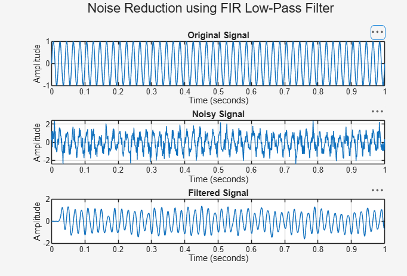

# Noise Reduction Filter Design using MATLAB

## Overview

This project demonstrates noise reduction from a signal using a digital FIR low-pass filter in MATLAB.

A clean sinusoidal signal is generated first. Random noise is then added to the signal, and an FIR low-pass filter is applied to reduce the unwanted noise.

## Features

- Signal generation using MATLAB
- Addition of random noise
- FIR low-pass filter design
- Noise reduction
- Before-and-after signal comparison
- Graphical visualization of the filtering process

## Working

A 50 Hz sinusoidal signal is generated with a sampling frequency of 1000 Hz.

Random noise is added to the original signal to create a noisy signal.

A 50th-order FIR low-pass filter with a cutoff frequency of 100 Hz is then designed and applied to the noisy signal.

The resulting filtered signal is compared with the original and noisy signals.

## Project Files

| File | Description |
|------|-------------|
| `noise_reduction_filter.m` | MATLAB code for signal generation, noise addition and filtering |
| `noise_reduction_result.png` | Simulation result showing the original, noisy and filtered signals |

## Simulation Result

The simulation compares the original signal, the noisy signal and the filtered signal.

## Tools & Technologies

- MATLAB
- Digital Signal Processing
- FIR Filter
- Low-Pass Filtering
- Signal Visualization

## Learning Outcome

This project helped in understanding:

- Digital signal processing concepts
- Noise and signal characteristics
- FIR filter design
- Low-pass filtering
- MATLAB signal visualization
- Comparison of signals before and after filtering

## Author

**Tavva Mohana Venkata Kavya**

ECE Student | Aspiring VLSI Engineer
